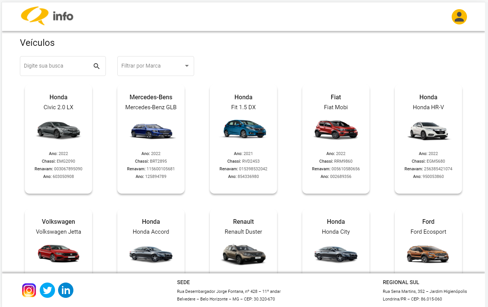

# InfoSistemas

## Tecnologias utilizadas 
- Angular@13.2.4
- Angular Material 
- Rxjs para simular o Mock do json

Protótipo Figma:
- [Protótipo Figma](https://www.figma.com/file/nip9d2dYlkJdhhStFH9r7o/Info-sistemas?node-id=0%3A1)


## Rodar o projeto
```
git clone "https://github.com/Roseffc/InfoSistemas.git"
cd InfoSistemas
npm install 
ng serve

Abrir navegador: http://localhost:4200
```
## Demo do Sistema
- [Info Sistema] (https://info-sistemas-t8j7.vercel.app/home)

## <p align="center"><br>Home</p>


